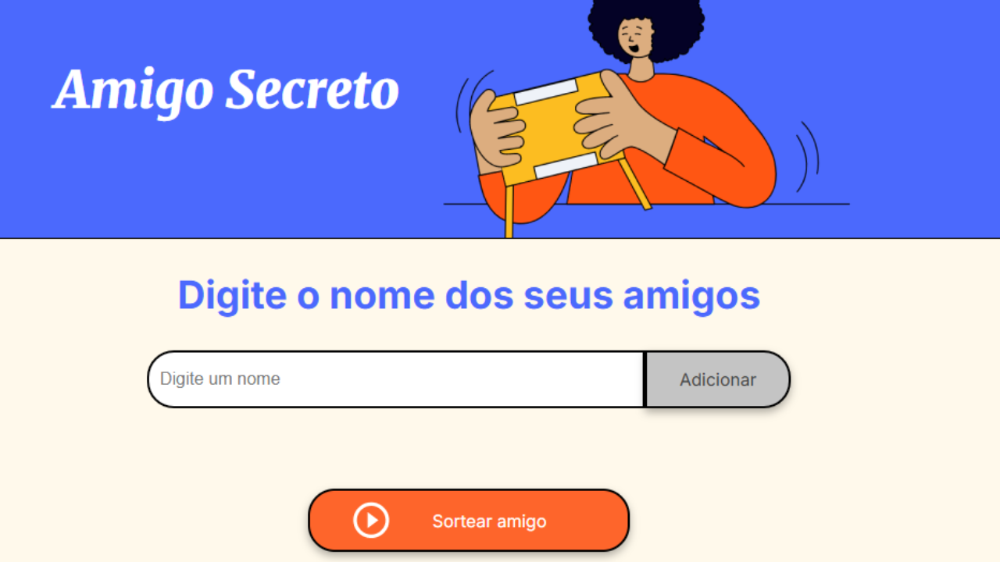

<h1 align="center"> 🎁 Amigo Secreto   </h1> 

🏷️ Badges  

  
  
  
  

 📑 Índice  
- [Descrição do Projeto](#-descrição-do-projeto)  
- [Status do Projeto](#-status-do-projeto)  
- [Funcionalidades da Aplicação](#-funcionalidades-da-aplicação)  
- [Acesso ao Projeto](#-acesso-ao-projeto)  
- [Tecnologias Utilizadas](#-tecnologias-utilizadas)  
- [Pessoas Desenvolvedoras do Projeto](#-pessoas-desenvolvedoras-do-projeto)
- [Licença](#-licença)  
- [Conclusão](#-conclusão)  

📝 Descrição do Projeto  
Este é um projeto simples em **HTML, CSS e JavaScript** que simula um sorteio de **Amigo Secreto**.  
O usuário pode adicionar os nomes dos amigos em uma lista e, com apenas um clique, sortear um deles aleatoriamente.  

É ideal para treinar **manipulação do DOM** e lógica em JavaScript.  

📌 Status do Projeto  
🚧 Concluído🚧  

✨ Funcionalidades e Demonstração da Aplicação  
- ✅ Adicionar nomes de amigos à lista.  
- ✅ Visualizar a lista em tempo real.  
- ✅ Sortear aleatoriamente um amigo.  
- 🚫 Não permite adicionar nomes vazios.  
- 🚫 Bloqueia o sorteio se houver menos de dois amigos.  

🔗 Acesso ao Projeto  
Você pode acessar o projeto clicando aqui: [https://challenge-amigo-secreto-five-kappa.vercel.app/]

💻 Tecnologias utilizadas  
- **HTML5**  
- **CSS3**  
- **JavaScript (ES6+)**  

👩‍💻 Pessoas Desenvolvedoras do Projeto  
- [Sara Monique](https://github.com/SaraMonique13)

📜 Licença  
Este projeto está sob a licença **MIT**.  

🎯 Conclusão  
O projeto **Amigo Secreto** é uma aplicação simples e divertida que mostra o poder do **JavaScript** para manipular o DOM e criar interatividade.  
É um ótimo ponto de partida para quem deseja aprender lógica de programação aplicada ao frontend.  
